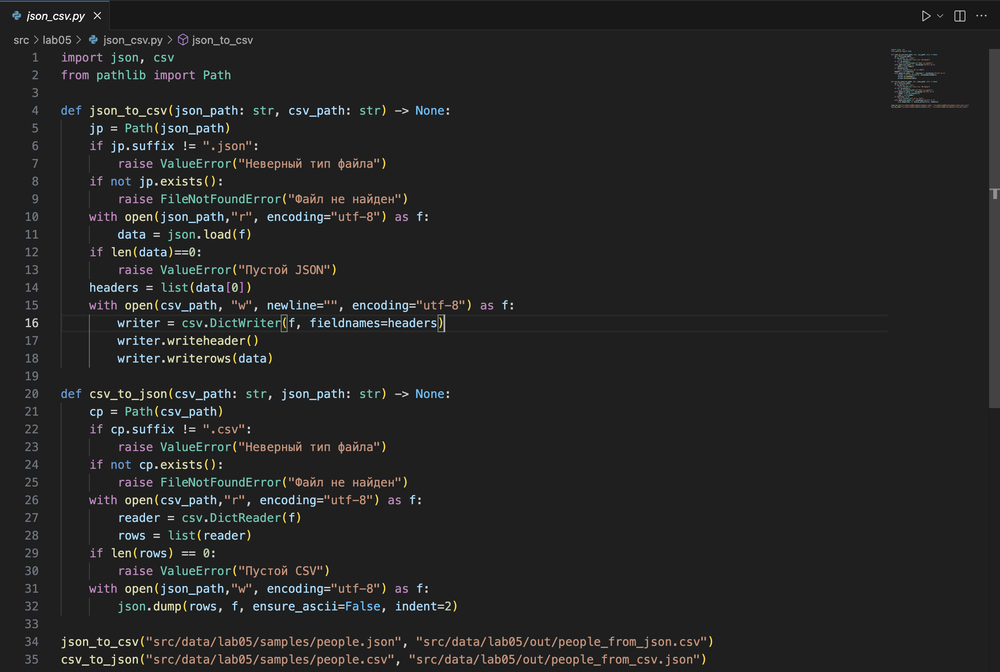
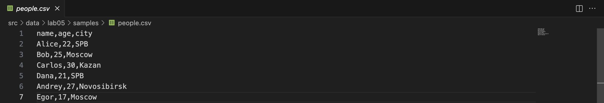
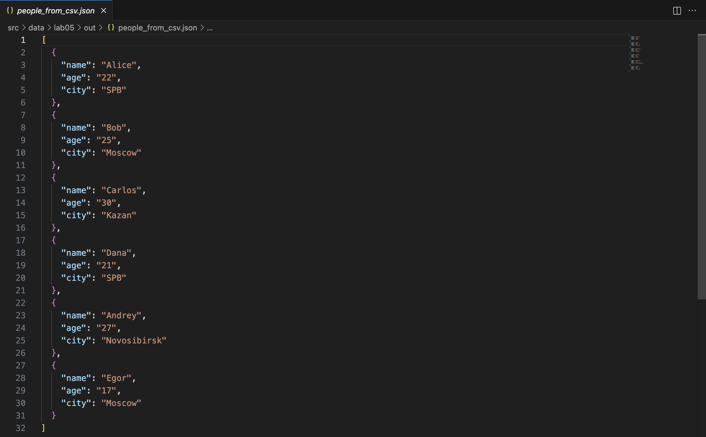
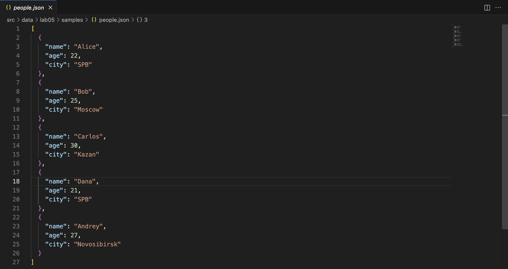
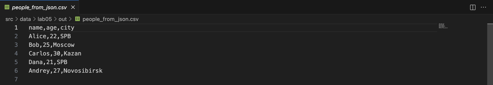
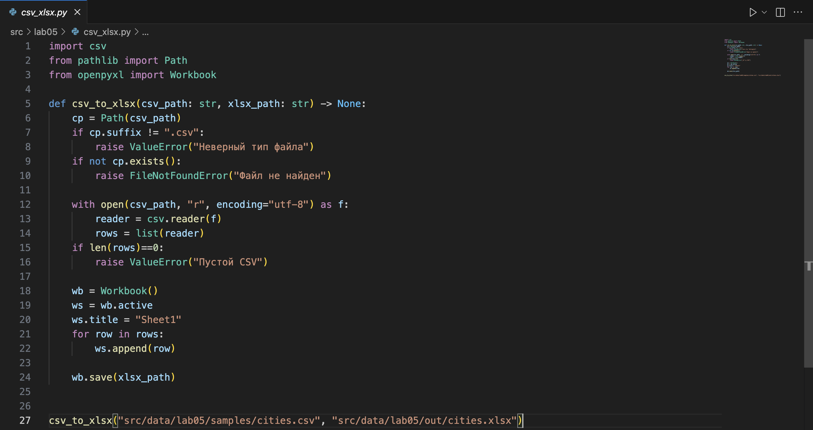
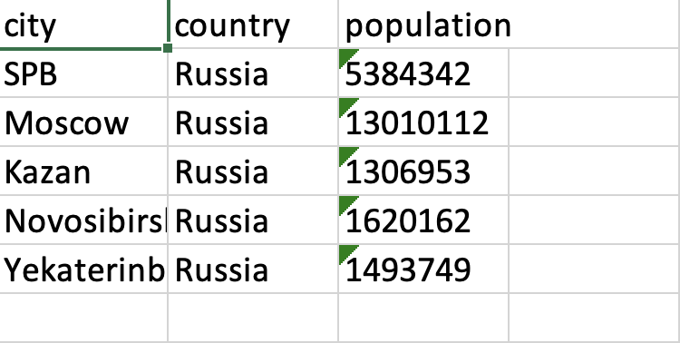
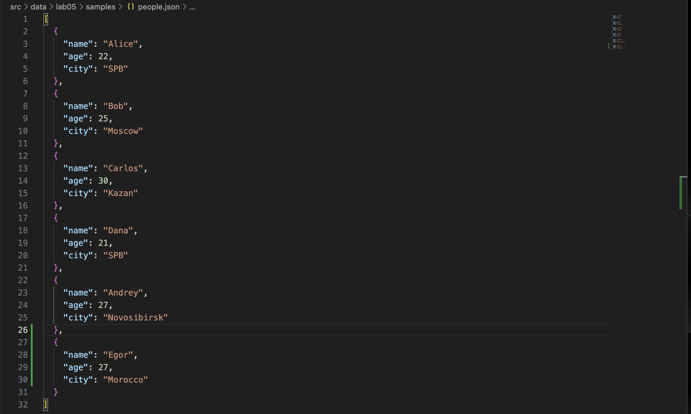
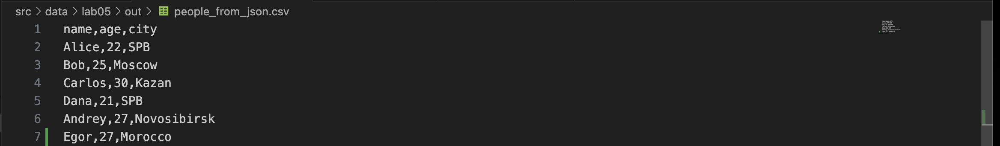
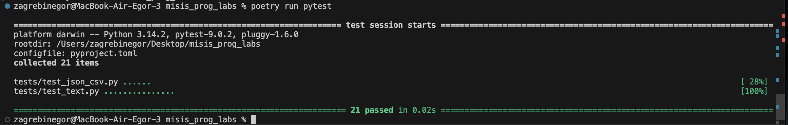

# ЛАБОРАТОРНАЯ РАБОТА №1 

# Загребин Егор Денисович БИВТ-25-4


# Задание №1

```python
name = input("What is your name? ")
age = int(input("What is your age? "))
print("Hello, " + name + "!" + "You'll be " + str(age + 1)  + " next year!")
```


# Задание №2

```python
a = float(input('a:').replace(',', '.'))
b = float(input('b:').replace(',', '.'))
print(f"sum: {a + b}\navg: {(a + b) / 2}")
```


# Задание №3

```python
price = float(input('Цена: '))
disc = float(input('Скидка: '))
vat = float(input('Налог: '))
base = price * (1 - disc/100)
vat_amount = base * (vat/100)
total = base + vat_amount
print(f'База после скидки: {base:.2f}')
print(f'НДС:               {vat_amount:.2f}')
print(f'Итого к оплате:    {total:.2f}')
```


# Задание №4

```python
m = int(input("Минуты: "))
print(f"{m // 60:02d}:{m % 60:02d}")
```


# Задание №5

```python
name = input('ФИО: ')
print(f'Инициалы: {''.join([i[0].upper() for i in name.split()])}.')
print(f'Длина (символов): {len(''.join(name.split())) + 2}')
```


# ЛАБОРАТОРНАЯ РАБОТА №2


# Задание 1 -> arrays

# 1 min_max

```python
def min_max(nums: list[float | int]) -> tuple[float | int, float | int]:
    if len(nums) == 0:
        return ValueError
    mn = 9e6 
    mx = -9e6 
    for i in range(len(nums)):
        if nums[i] < mn:
            mn = nums[i]
        if nums[i] > mx:
            mx = nums[i]
    return tuple([mn, mx])
print(min_max())
```


# 2 unique_sorted

```python
def unique_sorted(nums1: list[float | int]) -> list[float | int]:
    unique_nums = set(nums1)
    return sorted(unique_nums)
print(unique_sorted())
```


# 3 flatten

```python
def flatten(mat: list[list | tuple]) -> list:
    arr = list()
    for a in mat:
        if not(isinstance(a, list) or isinstance(a, tuple)):
            return TypeError
        for el in a:
            arr.append(el)
    return arr 
print(flatten())
```


# Задание 2 -> matrix

# Вспомогательная функция 
## С ее помощью проверяю длину строк матрицы. Если длина строк разная, значит матрица - рваная, возвращаю ValueError.

```python
def dliny(mat):
    if any(len(mat[0]) != len(mat[s]) for s in range(len(mat))):
        return False
    return True
```

# 1 transpose

```python
def transpose(mat: list[list[float | int]]) -> list[list]:
    if len(mat) == 0:
        return []
    if dliny(mat) == False:
        return ValueError
    newmat = [[0 for stro in range(len(mat))] for stol in range(len(mat[0]))]
    for strok in range(len(mat)):
        for stolb in range(len(mat[strok])):
            newmat[stolb][strok] = mat[strok][stolb]
    return newmat

print(transpose())
```


# 2 row_sums

```python
def row_sums(mat: list[list[float | int]]) -> list[float]:
    if len(mat) == 0:
        return []
    if dliny(mat) == False:
        return ValueError
    sums = []
    for i in mat:
        sums.append(sum(i))
    return sums

print(row_sums())
```


# 3 col_sums

```python
def col_sums(mat: list[list[float | int]]) -> list[float]:
    if dliny(mat) == False:
        return ValueError
    return row_sums(transpose(mat))

print(col_sums())
```


# Задание 3 -> tuples

```python
def format_record(rec: tuple[str, str, float]) -> str:
    
    name_processing = rec[0].strip().split()
    final_name = ''
    if len(name_processing) == 1:
        final_name = f"{name_processing[0][0].upper()}{name_processing[0][1:]}"
    elif len(name_processing) == 2:
        final_name = f"{name_processing[0][0].upper()}{name_processing[0][1:]} {name_processing[1][0:1].upper()}."
    elif len(name_processing) == 3:
        final_name = f"{name_processing[0][0].upper()}{name_processing[0][1:]} {name_processing[1][0:1].upper()}. {name_processing[2][0:1].upper()}."
    else:
        return ValueError
    
    group = ''
    group_processing = rec[1].strip()
    if group_processing == '':
        return ValueError
    else:
        group = group_processing

    gpa = float(rec[2])
    if not(isinstance(gpa, float)):
        return TypeError
    
    return f"{final_name}, гр. {group}, GPA: {gpa:.2f}"   

print(format_record(()))
```


# ЛАБОРАТОРНАЯ РАБОТА №3


## Задание A -> `src/lib/text.py`
## Реализую функции в модуле `src/lib/text.py`. 
## Далее вывожу результат в `src/lab03/A.py`. 

### normalize

```python
def normalize(text: str, *, casefold: bool = True, yo2e: bool = True) -> str:
    if not(isinstance(text, str)):
        return TypeError
    if casefold:
        text = text.casefold()
    if yo2e:
        text = text.replace('Ё', "Е").replace('ё', 'е')
    text = text.replace('\t', ' ').replace('\r', ' ').replace('\n', ' ')
    text = ' '.join(text.split())
    return text.strip()
```

### tokenize

```python
def tokenize(text: str) -> list[str]:
    if not(isinstance(text, str)):
        return TypeError
    pattern = r"\w+(?:-\w+)*"
    string = text
    tokens = finditer(pattern, string)
    return [i.group() for i in tokens]
```

### count_freq

```python
def count_freq(tokens: list[str]) -> dict[str, int]:
    if not(isinstance(tokens, list)):
        return TypeError
    freq = {}
    for i in tokens:
        if i in freq:
            freq[i] += 1
        else:
            freq[i] = 1
    return freq
```

### top_n

```python
def top_n(freq: dict[str, int], n: int = 5) -> list[tuple[str, int]]:
    return sorted(freq.items(), key=lambda x: (-x[1], x[0]))[:n]
```

### Вывод результата в `src/lab03/A.py`.
### Запуск из терминала `python3 -m src.lab03.A`. 

```python
from src.lib.text import normalize, tokenize, top_n, count_freq


print(normalize("ПрИвЕт\nМИр\t"))
print(normalize("ёжик, Ёлка", yo2e=True))
print(normalize("Hello\r\nWorld"))
print(normalize("  двойные   пробелы  "))


print(tokenize("привет мир"))
print(tokenize("hello,world!!!"))
print(tokenize("по-настоящему круто"))
print(tokenize("2025 год"))
print(tokenize("emoji 😀 не слово"))


print(top_n(count_freq(["a", "b", "a", "c", "b", "a"]), n=2))
print(top_n(count_freq(["bb", "aa", "bb", "aa", "cc"]), n=2))
```


## Задание B -> `src/lab03/B_text_stats`

### Читаем текст из stdin `src/lab03/input.txt`, вызваем функции из `src/lib/text.py`, выводим статистику. 
### Запуск из терминала: `python3 -m src.lab03.B_text_stats < src/lab03/input.txt`. 

```python
import sys
from src.lib.text import count_freq, top_n, normalize, tokenize

text = sys.stdin.read()

tokens = tokenize(text=normalize(text=text))
top = top_n(count_freq(tokens))

print(f"Всего слов: {len(tokens)}")
print(f"Уникальных слов: {len(set(tokens))}")
print("Топ-5:")
for w, c in top:
    print(f"{w}:{c}")
```


# ЛАБОРАТОРНАЯ РАБОТА №4

## Задание А -> `src/lab04/io_txt_csv.py`

## Реализую функции: 
### 1. `read_text(path: str | Path, encoding: str = "utf-8") -> str`  
        - Открыть файл на чтение в указанной кодировке и вернуть содержимое **как одну строку**;  
        - Обрабатывать ошибки: если файл не найден — поднимать `FileNotFoundError` (пусть падает), если кодировка не подходит — поднимать `UnicodeDecodeError` (пусть падает);  
        - НО: в докстринге опишите, как пользователь может выбрать другую кодировку (пример: `encoding="cp1251"`).
### 2. `write_csv(rows: list[tuple | list], path: str | Path, header: tuple[str,...] | None) -> None`  
        - Создать/перезаписать CSV с разделителем `,`;  
        - Если передан `header`, записать его первой строкой;  
        - Проверить, что каждая строка в `rows` имеет одинаковую длину (иначе `ValueError`).

```python
import csv
from pathlib import Path
from typing import Iterable, Sequence


def read_text(path: str | Path, encoding: str = "utf-8") -> str:
    p = Path(path)
    return p.read_text(encoding=encoding)

def write_csv(rows: Iterable[Sequence], path: str | Path,
              header: tuple[str, ...] | None = None) -> None:
    p = Path(path)
    rows = list(rows)
    if rows:
        cols = len(rows[0])
        for r in rows:
            if len(r) != cols:
                raise ValueError("Разная длина строк")
    with p.open("w", newline="", encoding="utf-8") as f:
        w = csv.writer(f)
        if header is not None:
            w.writerow(header)
        for r in rows:
            w.writerow(r)
```

## Задание В -> `src/lab04/text_report.py`
### Запуск из терминала `python3 -m src.lab04.text_report`.

1) Читает **один** входной файл `data/input.txt`.  
2) Нормализует текст (`lib/text.py`), токенизирует и считает частоты слов.  
3) Сохраняет `data/report.csv` c колонками: **`word,count`**, отсортированными: count ↓, слово ↑ (при равенстве).  
4) В консоль печатает краткое резюме:  
   - `Всего слов: <N>`  
   - `Уникальных слов: <K>`  
   - `Топ-5:` (список из `top_n` из ЛР3)

```python
from src.lab04.io_txt_csv import read_text, write_csv
from src.lib.text import count_freq, top_n, normalize, tokenize
from pathlib import Path

def text_progress(text):
    tokens = tokenize(normalize(text))
    freq = count_freq(tokens)
    return tokens, freq

in_path = Path("src/data/lab04/input.txt")
out_path = Path("src/data/lab04/report.csv")

text = read_text(in_path)
tokens, freq = text_progress(text)
write_csv(top_n(freq, len(freq)), out_path, header=("word", "count"))

print("Всего слов:", len(tokens))
print("Уникальных слов:", len(freq))
print("Топ-5:")
for word, count in top_n(freq, 5):
    print(f"{word}: {count}")
```

## Выполнение:

### Вход -> `data/lab04/input.txt`:
Привет, мир!!! Привет!

### Вывод в терминале:


### Отчет CSV -> `data/lab04/report.csv`:


# ЛАБОРАТОРНАЯ РАБОТА №5

## Задание А -> `src/lab05/json_csv.py`

#### **Требования**:
 - Проверка ошибок: 
    - неверный тип файла, пустой JSON или CSV → `ValueError`.
    - осутствующий файл → `FileNotFoundError`
 - Не использовать внешние пакеты (только json, csv, pathlib).
 - Все пути относительные.
 - Кодировка — строго UTF-8.


```python
import json, csv
from pathlib import Path

def json_to_csv(json_path: str, csv_path: str) -> None:
    jp = Path(json_path)
    if jp.suffix != ".json":
        raise ValueError("Неверный тип файла")
    if not jp.exists():
        raise FileNotFoundError("Файл не найден")
    with open(json_path,"r", encoding="utf-8") as f:
        data = json.load(f)
    if len(data)==0:
        raise ValueError("Пустой JSON")
    headers = list(data[0])
    with open(csv_path, "w", newline="", encoding="utf-8") as f:
        writer = csv.DictWriter(f, fieldnames=headers)
        writer.writeheader()
        writer.writerows(data)

def csv_to_json(csv_path: str, json_path: str) -> None:
    cp = Path(csv_path)
    if cp.suffix != ".csv":
        raise ValueError("Неверный тип файла")
    if not cp.exists():
        raise FileNotFoundError("Файл не найден")
    with open(csv_path,"r", encoding="utf-8") as f:
        reader = csv.DictReader(f)
        rows = list(reader)
    if len(rows) == 0:
        raise ValueError("Пустой CSV")
    with open(json_path,"w", encoding="utf-8") as f:
        json.dump(rows, f, ensure_ascii=False, indent=2)
```




## Выполнение:

### Обрабатываемые файлы -> `src/data/lab05/samples`

#### Перевод `CSV -> JSON`:

Исходный `src/data/lab05/samples/people.csv`


Результат перевода в JSON -> `src/data/lab05/out/people_from_csv.json`:


#### Перевод `JSON -> CSV`:

Исходный `src/data/lab05/samples/people.json`


Результат перевода в CSV -> `src/data/lab05/out/people_from_json.csv`:



## Задание В -> `src/lab05/csv_xlsx.py`

#### **Требования**:
 - Проверка ошибок: 
    - неверный тип файла, пустой JSON или CSV → `ValueError`.
    - осутствующий файл → `FileNotFoundError`
 - Не использовать внешние пакеты.
 - Все пути относительные.
 - Кодировка — строго UTF-8.
 - Результат — открываемый XLSX с корректной структурой таблицы.

 ```python
import csv
from pathlib import Path
from openpyxl import Workbook

def csv_to_xlsx(csv_path: str, xlsx_path: str) -> None:
    cp = Path(csv_path)
    if cp.suffix != ".csv":
        raise ValueError("Неверный тип файла")
    if not cp.exists():
        raise FileNotFoundError("Файл не найден")

    with open(csv_path, "r", encoding="utf-8") as f:
        reader = csv.reader(f)
        rows = list(reader)
    if len(rows)==0:
        raise ValueError("Пустой CSV")

    wb = Workbook()
    ws = wb.active
    ws.title = "Sheet1"
    for row in rows:
        ws.append(row)

    wb.save(xlsx_path)

csv_to_xlsx("src/data/lab05/samples/cities.csv", "src/data/lab05/out/cities.xlsx")
```


## Выполнение:

#### Перевод `CSV -> XLSX`:

Исходный `src/data/lab05/samples/cities.xlsx`


Результат перевода в XSLX -> `src/data/lab05/out/cities.xlsx`:



# ЛАБОРАТОРНАЯ РАБОТА №6
## Задание А -> `src/lab06/cli_text.py`
#### **Требования**:
 - `stats --input <txt> [--top 5]` — анализ частот слов в тексте (использовать функции из `lab03`);
 - `cat --input <path> [-n]` — вывод содержимого файла построчно (с нумерацией при `-n`).

#### Выполнение:
```python
import argparse
from pathlib import Path
from src.lib.text import count_freq, top_n, normalize, tokenize


def main():
    parser = argparse.ArgumentParser(description="CLI‑утилиты лабораторной №6")
    subparsers = parser.add_subparsers(dest="command")

    cat_parser = subparsers.add_parser("cat", help="Вывести содержимое файла")
    cat_parser.add_argument("--input", required=True)
    cat_parser.add_argument("-n", action="store_true", help="Нумеровать строки")

    stats_parser = subparsers.add_parser("stats", help="Частоты слов")
    stats_parser.add_argument("--input", required=True)
    stats_parser.add_argument("--top", type=int, default=5)

    args = parser.parse_args()

    filepath = Path(args.input)

    if not filepath.exists():
        raise FileNotFoundError(f"Файл {filepath} не найден")

    if args.command == "cat":

        with filepath.open("r", encoding="utf-8") as f:
            num = 1
            for line in f:
                line = line.rstrip("\n")
                if args.n:
                    print(f"{num}: {line}")
                    num += 1
                else:
                    print(line)

    elif args.command == "stats":

        content = [i for i in filepath.open("r", encoding="utf-8")]
        tokens = tokenize(text="".join(content))
        freq = count_freq(tokens=tokens)
        top = top_n(freq=freq, n=args.top)

        num = 1
        for q, w in top:
            print(f"{num}. {q} - {w}")
            num += 1


if __name__ == "__main__":
    main()
```

#### Результат:
1. Вывод содержимого файла построчно (с нумерацией при `-n`).
Команда:
`python3 -m src.lab06.cli_text cat --input src/data/lab05/samples/cities.csv -n`


2. Анализ частот слов в тексте. 
Команда:
`python3 -m src.lab06.cli_text stats --input src/lab03/input.txt --top 5`


## Задание В -> `src/lab06/cli_convert.py`
#### **Требования**:
  - `json2csv --in data/samples/people.json --out data/out/people.csv`  
  - `csv2json --in data/samples/people.csv --out data/out/people.json`  
  - `csv2xlsx --in data/samples/people.csv --out data/out/people.xlsx`  

#### Выполнение:
```python
import argparse

from src.lab05.csv_xlsx import csv_to_xlsx
from src.lab05.json_csv import csv_to_json, json_to_csv


def main():

    parser = argparse.ArgumentParser(description="CLI-утилиты лабораторной №6")
    subparsers = parser.add_subparsers(dest="command")

    # --- json2csv ---
    json2csv_parser = subparsers.add_parser(
        "json2csv", help="Конвертировать JSON в CSV"
    )
    json2csv_parser.add_argument(
        "--in", dest="input", required=True, help="Путь к JSON-файлу"
    )
    json2csv_parser.add_argument(
        "--out", dest="output", required=True, help="Путь для CSV-файла"
    )

    # --- csv2json ---
    csv2json_parser = subparsers.add_parser(
        "csv2json", help="Конвертировать CSV в JSON"
    )
    csv2json_parser.add_argument(
        "--in", dest="input", required=True, help="Путь к CSV-файлу"
    )
    csv2json_parser.add_argument(
        "--out", dest="output", required=True, help="Путь для JSON-файла"
    )

    # --- csv2xlsx ---
    csv2xlsx_parser = subparsers.add_parser(
        "csv2xlsx", help="Конвертировать CSV в XLSX"
    )
    csv2xlsx_parser.add_argument(
        "--in", dest="input", required=True, help="Путь к CSV-файлу"
    )
    csv2xlsx_parser.add_argument(
        "--out", dest="output", required=True, help="Путь для XLSX-файла"
    )

    args = parser.parse_args()

    if args.command == "json2csv":
        json_to_csv(
            json_path=args.input,
            csv_path=args.output,
        )

    elif args.command == "csv2json":
        csv_to_json(
            csv_path=args.input,
            json_path=args.output,
        )

    elif args.command == "csv2xlsx":
        csv_to_xlsx(
            csv_path=args.input,
            xlsx_path=args.output,
        )


if __name__ == "__main__":
    main()
```

#### Результат:
1. **Конвертация `JSON -> CSV`**

 Команда:
`python3 -m src.lab06.cli_convert json2csv --in src/data/lab05/samples/people.json --out src/data/lab05/out/people_from_json.csv`
 
 Исходная директория `src/data/lab05/samples/people.json`:

 
 Результат в `src/data/lab05/out/people_from_json.csv`:


2. **Аналогично и для `csv2json` & `csv2xlsx`**:
 
 -`python3 -m src.lab06.cli_convert csv2json --in src/data/lab05/samples/people.csv --out src/data/lab05/out/people_from_csv.json`
 
 -`python3 -m src.lab06.cli_convert csv2xlsx --in src/data/lab05/samples/cities.csv --out src/data/lab05/out/cities.xlsx`

# ЛАБОРАТОРНАЯ РАБОТА №7

## Задание А -> `tests/test_text.py`

Написать автотесты для всех публичных функций модуля `src/lib/text.py`:

- `normalize(text: str) -> str`
- `tokenize(text: str) -> list[str]`
- `count_freq(tokens: list[str]) -> dict[str, int]`
- `top_n(freq: dict[str, int], n: int) -> list[tuple[str, int]]`

**Требования:**

- покрыть как минимум:
  - базовые случаи (обычный текст),
  - граничные случаи (пустые строки, повторы, спецсимволы),
  - сценарий с одинаковой частотой слов (проверка сортировки по алфавиту при равных значениях);
- использовать `pytest`.

#### Выполнение: 

```python
import pytest
from src.lib.text import normalize, tokenize, count_freq, top_n


@pytest.mark.parametrize(
    "source, expected",
    [
        ("ПрИвЕт\nМИр\t", "привет мир"),
        ("ёжик, Ёлка", "ежик, елка"),
        ("Hello\r\nWorld", "hello world"),
        ("  двойные   пробелы  ", "двойные пробелы"),
        ("", ""),
    ],
)
def test_normalize_basic(source, expected):
    assert normalize(source) == expected


@pytest.mark.parametrize(
    "text, expected",
    [
        ("привет мир", ["привет", "мир"]),
        ("hello,world!!!", ["hello", "world"]),
        ("по-настоящему круто", ["по-настоящему", "круто"]),
        ("2025 год", ["2025", "год"]),
        ("emoji 😀 не слово", ["emoji", "не", "слово"]),
        ("", []),
    ],
)
def test_tokenize_basic(text, expected):
    assert tokenize(text) == expected


def test_count_freq_and_top_n():
    tokens = ["a", "b", "a", "c", "b", "a"]
    freq = count_freq(tokens)
    assert freq == {"a": 3, "b": 2, "c": 1}
    assert top_n(freq, 2) == [("a", 3), ("b", 2)]


def test_top_n_tie_breaker():
    tokens = ["bb", "aa", "bb", "aa", "cc"]
    freq = count_freq(tokens)
    assert top_n(freq, 2) == [("aa", 2), ("bb", 2)]


def test_count_freq_empty_tokens():
    assert count_freq([]) == {}


def test_top_n_empty_freq():
    assert top_n({}, 5) == []

```

## Задание В -> `tests/test_json_csv.py`

Тесты для `src/lab05/json_csv.py`

Написать автотесты для функций:

- `json_to_csv(src_path: str, dst_path: str)`
- `csv_to_json(src_path: str, dst_path: str)`

#### Выполнение: 

```python
import pytest
import csv
import json
from pathlib import Path
from src.lab05.json_csv import json_to_csv, csv_to_json


def test_json_to_csv_roundtrip(tmp_path: Path):
    src = tmp_path / "people.json"
    dst = tmp_path / "people.csv"
    data = [
        {"name": "Alice", "age": 22},
        {"name": "Bob", "age": 25},
    ]
    src.write_text(
        json.dumps(data, ensure_ascii=False, indent=2),
        encoding="utf-8",
    )
    json_to_csv(str(src), str(dst))

    with dst.open(encoding="utf-8", newline="") as f:
        rows = list(csv.DictReader(f))

    assert len(rows) == len(data)
    assert {"name", "age"} <= set(rows[0].keys())


def test_csv_to_json_roundtrip(tmp_path: Path):
    src = tmp_path / "people.csv"
    dst = tmp_path / "people.json"
    rows = [
        {"name": "Alice", "age": "22"},
        {"name": "Bob", "age": "25"},
    ]
    with src.open("w", encoding="utf-8", newline="") as f:
        writer = csv.DictWriter(f, fieldnames=["name", "age"])
        writer.writeheader()
        writer.writerows(rows)

    csv_to_json(str(src), str(dst))
    data = json.loads(dst.read_text(encoding="utf-8"))

    assert len(data) == len(rows)
    assert set(data[0].keys()) == {"name", "age"}


def test_json_to_csv_raises_value_error(tmp_path: Path):
    src = tmp_path / "empty.json"
    dst = tmp_path / "out.csv"

    src.write_text("[]", encoding="utf-8")

    with pytest.raises(ValueError):
        json_to_csv(str(src), str(dst))


def test_csv_to_json_raises_value_error(tmp_path: Path):
    src = tmp_path / "empty.csv"
    dst = tmp_path / "out.json"

    src.write_text("", encoding="utf-8")

    with pytest.raises(ValueError):
        csv_to_json(str(src), str(dst))


def test_json_to_csv_raises_file_not_found_error():
    with pytest.raises(FileNotFoundError):
        json_to_csv("111.json", "out.csv")


def test_csv_to_json_raises_file_not_found_error():
    with pytest.raises(FileNotFoundError):
        csv_to_json("1111.csv", "out.json")
```


#### Результат:
 
 -`Тесты`


 -`Форматирование кода через poetry black`
 


