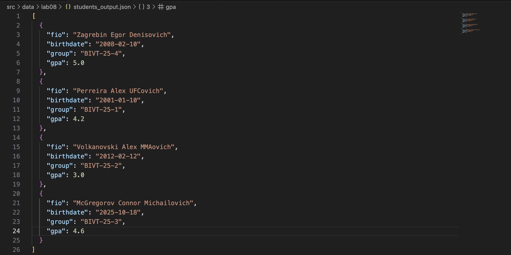

# ЛАБОРАТОРНАЯ РАБОТА №7

## Задание А -> `tests/test_text.py`

Написать автотесты для всех публичных функций модуля `src/lib/text.py`:

- `normalize(text: str) -> str`
- `tokenize(text: str) -> list[str]`
- `count_freq(tokens: list[str]) -> dict[str, int]`
- `top_n(freq: dict[str, int], n: int) -> list[tuple[str, int]]`

**Требования:**

- покрыть как минимум:
  - базовые случаи (обычный текст),
  - граничные случаи (пустые строки, повторы, спецсимволы),
  - сценарий с одинаковой частотой слов (проверка сортировки по алфавиту при равных значениях);
- использовать `pytest`.

#### Выполнение: 

```python
import pytest
from src.lib.text import normalize, tokenize, count_freq, top_n


@pytest.mark.parametrize(
    "source, expected",
    [
        ("ПрИвЕт\nМИр\t", "привет мир"),
        ("ёжик, Ёлка", "ежик, елка"),
        ("Hello\r\nWorld", "hello world"),
        ("  двойные   пробелы  ", "двойные пробелы"),
        ("", ""),
    ],
)
def test_normalize_basic(source, expected):
    assert normalize(source) == expected


@pytest.mark.parametrize(
    "text, expected",
    [
        ("привет мир", ["привет", "мир"]),
        ("hello,world!!!", ["hello", "world"]),
        ("по-настоящему круто", ["по-настоящему", "круто"]),
        ("2025 год", ["2025", "год"]),
        ("emoji 😀 не слово", ["emoji", "не", "слово"]),
        ("", []),
    ],
)
def test_tokenize_basic(text, expected):
    assert tokenize(text) == expected


def test_count_freq_and_top_n():
    tokens = ["a", "b", "a", "c", "b", "a"]
    freq = count_freq(tokens)
    assert freq == {"a": 3, "b": 2, "c": 1}
    assert top_n(freq, 2) == [("a", 3), ("b", 2)]


def test_top_n_tie_breaker():
    tokens = ["bb", "aa", "bb", "aa", "cc"]
    freq = count_freq(tokens)
    assert top_n(freq, 2) == [("aa", 2), ("bb", 2)]


def test_count_freq_empty_tokens():
    assert count_freq([]) == {}


def test_top_n_empty_freq():
    assert top_n({}, 5) == []

```

## Задание В -> `tests/test_json_csv.py`

Тесты для `src/lab05/json_csv.py`

Написать автотесты для функций:

- `json_to_csv(src_path: str, dst_path: str)`
- `csv_to_json(src_path: str, dst_path: str)`

#### Выполнение: 

```python
import pytest
import csv
import json
from pathlib import Path
from src.lab05.json_csv import json_to_csv, csv_to_json


def test_json_to_csv_roundtrip(tmp_path: Path):
    src = tmp_path / "people.json"
    dst = tmp_path / "people.csv"
    data = [
        {"name": "Alice", "age": 22},
        {"name": "Bob", "age": 25},
    ]
    src.write_text(
        json.dumps(data, ensure_ascii=False, indent=2),
        encoding="utf-8",
    )
    json_to_csv(str(src), str(dst))

    with dst.open(encoding="utf-8", newline="") as f:
        rows = list(csv.DictReader(f))

    assert len(rows) == len(data)
    assert {"name", "age"} <= set(rows[0].keys())


def test_csv_to_json_roundtrip(tmp_path: Path):
    src = tmp_path / "people.csv"
    dst = tmp_path / "people.json"
    rows = [
        {"name": "Alice", "age": "22"},
        {"name": "Bob", "age": "25"},
    ]
    with src.open("w", encoding="utf-8", newline="") as f:
        writer = csv.DictWriter(f, fieldnames=["name", "age"])
        writer.writeheader()
        writer.writerows(rows)

    csv_to_json(str(src), str(dst))
    data = json.loads(dst.read_text(encoding="utf-8"))

    assert len(data) == len(rows)
    assert set(data[0].keys()) == {"name", "age"}


def test_json_to_csv_raises_value_error(tmp_path: Path):
    src = tmp_path / "empty.json"
    dst = tmp_path / "out.csv"

    src.write_text("[]", encoding="utf-8")

    with pytest.raises(ValueError):
        json_to_csv(str(src), str(dst))


def test_csv_to_json_raises_value_error(tmp_path: Path):
    src = tmp_path / "empty.csv"
    dst = tmp_path / "out.json"

    src.write_text("", encoding="utf-8")

    with pytest.raises(ValueError):
        csv_to_json(str(src), str(dst))


def test_json_to_csv_raises_file_not_found_error():
    with pytest.raises(FileNotFoundError):
        json_to_csv("111.json", "out.csv")


def test_csv_to_json_raises_file_not_found_error():
    with pytest.raises(FileNotFoundError):
        csv_to_json("1111.csv", "out.json")
```


#### Результат:
 
 -`Тесты`


 -`Форматирование кода через poetry black`
 


# ЛАБОРАТОРНАЯ РАБОТА №8

## Задание А -> `src/lab08/models.py`.

**Требования**:

Модель **`Student`**, содержащая:

- декоратор `@dataclass`
- поля:
  - `fio`
  - `birthdate`
  - `group`
  - `gpa`
- методы:
  - `age()`
  - `to_dict()`
  - `from_dict()`
  - `__str__()`
- валидацию:
  - формата даты (`YYYY-MM-DD`)
  - диапазона среднего балла `0 ≤ gpa ≤ 5`


#### Выполнение:

```python
from dataclasses import dataclass
from datetime import datetime, date


@dataclass
class Student:
    fio: str
    birthdate: str
    group: str
    gpa: float

    def __post_init__(self):
        try:
            datetime.strptime(self.birthdate, "%Y-%m-%d")
        except ValueError:
            raise ValueError("warning: birthdate format might be invalid")

        if not (0 <= self.gpa <= 5):
            raise ValueError("gpa must be between 0 and 5")

    def age(self):
        b = datetime.strptime(self.birthdate, "%Y-%m-%d").date()
        today = date.today()
        return today.year - b.year - ((today.month, today.day) < (b.month, b.day))

    def to_dict(self):
        return {
            "fio": self.fio,
            "birthdate": self.birthdate,
            "group": self.group,
            "gpa": self.gpa,
        }

    @classmethod
    def from_dict(cls, d: dict):
        return cls(
            fio=d["fio"],
            birthdate=d["birthdate"],
            group=d["group"],
            gpa=d["gpa"],
        )

    def __str__(self):
        return f"{self.fio} ({self.group}), gpa={self.gpa}"


if __name__ == "__main__":
    # Create
    student = Student("Zagrebin Egor Denisovich", "2008-02-10", "BIVT-25-4", 5.0)
    print(student)
    print(f"Age: {student.age()}")

    # Serialize
    student_dict = student.to_dict()
    print(f"Serialized: {student_dict}")

    # Deserialize
    restored_student = Student.from_dict(student_dict)
    print(f"Restored: {restored_student}")
```

#### Результат:


## Задание B -> `src/lab08/serialize.py`

**Требования**:

Реализовать фунцкии для сериализации 

1. `students_to_json(students, path)`

Сохраняет список студентов в JSON.

2. `students_from_json(path) -> list[Student]`

-   читает JSON-массив
-   валидирует
-   создаёт список `Student`

#### Выполнение:

```python
import json
from src.lab08.models import Student


def students_to_json(students, path):
    data = [s.to_dict() for s in students]
    with open(path, 'w', encoding='utf-8') as f:
        json.dump(data, f, ensure_ascii=False, indent=2)

def students_from_json(path):
    with open(path, 'r', encoding='utf-8') as f:
        data = json.load(f)
    return [Student.from_dict(d) for d in data]

s1 = Student("Zagrebin Egor Denisovich", "2008-02-10", "BIVT-25-4", 5.0)
s2 = Student("Perreira Alex UFCovich", "2001-01-10", "BIVT-25-1", 4.2)
s3 = Student("Volkanovski Alex MMAovich", "2012-02-12", "BIVT-25-2", 3.0)
s4 = Student("McGregorov Connor Michailovich", "2025-10-18", "BIVT-25-3", 4.6)

students = [s1, s2, s3, s4]

students_to_json(students, path='src/data/lab08/students_output.json')
```

#### Результат:

```python
s1 = Student("Zagrebin Egor Denisovich", "2008-02-10", "BIVT-25-4", 5.0)
s2 = Student("Perreira Alex UFCovich", "2001-01-10", "BIVT-25-1", 4.2)
s3 = Student("Volkanovski Alex MMAovich", "2012-02-12", "BIVT-25-2", 3.0)
s4 = Student("McGregorov Connor Michailovich", "2025-10-18", "BIVT-25-3", 4.6)

students = [s1, s2, s3, s4]
```
Исходный список объектов класса Student был сериализован в формате JSON и сохранён в файл `src/data/lab08/students_output.json`. 




# ЛАБОРАТОРНАЯ РАБОТА №9

## Задание А -> `src/lab09/group.py`

**Требования**:

Класс **`Group`**, реализующий CRUD-операции над студентами:

- инициализацию с путём к CSV-файлу (`__init__`)
- чтение всех записей из CSV
- методы:
  - `add(student: Student)` — добавление студента
  - `list() -> list[Student]` — получить всех студентов
  - `find(substr: str)` — поиск по подстроке в ФИО
  - `remove(fio: str)` — удаление по ФИО
  - `update(fio: str, **fields)` — обновление полей существующей записи

#### Выполнение:

```python
import csv
from pathlib import Path
from src.lab08.models import Student

class Group:
    def __init__(self, storage_path: str):
        self.path = Path(storage_path)
        self.fieldnames = ["fio", "birthdate", "group", "gpa"]
        if not self.path.exists():
            with open(self.path, "w", encoding="utf-8", newline="") as f:
                writer = csv.DictWriter(f, fieldnames=self.fieldnames)
                writer.writeheader()

    def _read_all(self):
        with open(self.path, "r", encoding="utf-8") as f:
            reader = csv.DictReader(f)
            return list(reader)

    def list(self):
        rows = self._read_all()
        return [
            Student(
                fio=row["fio"],
                birthdate=row["birthdate"],
                group=row["group"],
                gpa=float(row["gpa"]),
            )
            for row in rows
        ]

    def add(self, student: Student):
        with open(self.path, "a", encoding="utf-8", newline="") as f:
            writer = csv.DictWriter(f, fieldnames=self.fieldnames)
            writer.writerow(student.to_dict())

    def find(self, substr: str):
        students = self.list()
        result = []
        substr_lower = substr.lower()
        for s in students:
            if substr_lower in s.fio.lower():
                result.append(s)
        return result

    def remove(self, fio: str):
        rows = self._read_all()
        rows = [r for r in rows if r["fio"] != fio]
        with open(self.path, "w", encoding="utf-8", newline="") as f:
            writer = csv.DictWriter(f, fieldnames=self.fieldnames)
            writer.writeheader()
            writer.writerows(rows)

    def update(self, fio: str, **fields):
        rows = self._read_all()
        for r in rows:
            if r["fio"] == fio:
                for key, value in fields.items():
                    r[key] = value
        with open(self.path, "w", encoding="utf-8", newline="") as f:
            writer = csv.DictWriter(f, fieldnames=self.fieldnames)
            writer.writeheader()
            writer.writerows(rows)
```

#### Результат:

Данные хранятся в `src/data/lab09/students.csv`, работать будем с ними. 

Для удобства проверки CRUD-операций, реализуемых в ЛР9, я буду использовать модуль `src/lab09/test.py`.

```python
from src.lab09.group import Group
from src.lab08.models import Student

group = Group("src/data/lab09/students.csv")
group.update("Perreira Alex UFCovich", gpa=2.0)
for s in group.list():
    print(s)
```

**Проверка выполнения**:

- **add**

Изначально `students.csv` имел вид:


В **`src/lab09/test.py`** прописываю:
 `group.add(Student("McGregorov Connor Michailovich", "2025-10-18", "BIVT-25-3", 4.6))`

Конечный результат, полученный после добавления студеннта:


- **remove**

Теперь `students.csv` выглядит так:


В **`src/lab09/test.py`** указываю:
 `group.remove("McGregorov Connor Michailovich")`

Результат выполнения:


- **update**

Начальный вид `students.csv`:


Изменяю **`src/lab09/test.py`**:
 `group.update("Perreira Alex UFCovich", gpa=2.0)`

Финальный результат:


# ЛАБОРАТОРНАЯ РАБОТА №10

## Задание А -> `src/lab10/structures.py`. 

### Реализовать **`Stack`** и **`Queue`**: 

**Требования**:

**`Stack`**

**Методы (минимум):**

- `push(item) -> None`  
  Добавить элемент на вершину стека.

- `pop() -> Any`  
  Снять верхний элемент стека и вернуть его.  
  Если стек пуст — выбросить понятное исключение (например, `IndexError` с вменяемым сообщением).

- `peek() -> Any | None`  
  Вернуть верхний элемент **без удаления**.  
  Если стек пуст — вернуть `None` (или тоже бросать исключение, но тогда это нужно описать в README).

- `is_empty() -> bool`  
  Вернуть `True`, если стек пуст, иначе `False`.

- `is_empty() -> bool`  
  Вернуть `True`, если очередь пуста.

**`Queue`**

**Методы (минимум):**

- `enqueue(item) -> None`  
  Добавить элемент в конец очереди.

- `dequeue() -> Any`  
  Взять элемент из начала очереди и вернуть его.  
  Если очередь пустая — выбросить понятное исключение (например, `IndexError`).

- `peek() -> Any | None`  
  Вернуть первый элемент **без удаления**.  
  Если очередь пустая — вернуть `None` (или бросить исключение, но это нужно явно описать).

- `is_empty() -> bool`  
  Вернуть `True`, если очередь пуста.

#### Выполнение:

```python
from collections import deque


class Stack:
    def __init__(self):
        self._data = []

    def push(self, item):
        self._data.append(item)  # добавить на вершину

    def pop(self):
        if self.is_empty():
            raise IndexError("стек пустой")
        return self._data.pop()  # снять верхний

    def peek(self):
        if self.is_empty():
            return None
        return self._data[-1]  # вернуть верхний без удаления

    def is_empty(self):
        return len(self._data) == 0  # вернуть True, если стек пуст


class Queue:
    def __init__(self):
        self._data = deque()

    def enqueue(self, item):
        self._data.append(item)  # добавить в конец очереди

    def dequeue(self):
        if self.is_empty():
            raise IndexError("очередь пустая")
        return self._data.popleft()  # взять из начала очереди

    def peek(self):
        if not self._data:
            return None
        return self._data[0]  # вернуть первый элемент без удаления

    def is_empty(self):
        return len(self._data) == 0  # вернуть True, если очередь пуста
```
#### Результат тестирования:

Для удобства тестирования, использую отдельный модуль `src/lab10/tests/test_structures.py`. 


## Задание В -> `src/lab10/linked_list.py`

### Реализовать **`SinglyLinkedList`**:

**Требования**:

**Методы (минимум):**

- `append(value) -> None`  
  Добавить элемент в конец списка.  
  При наличии `tail` — за `O(1)`, без него — допустимо `O(n)` проходом от `head`.

- `prepend(value) -> None`  
  Добавить элемент в начало списка за `O(1)`.

- `insert(idx: int, value) -> None`  
  Вставить элемент по индексу `idx`.  
  Требования:
  - допускается вставка в начало (`idx == 0`) и в конец (`idx == len(list)`);
  - при индексе вне диапазона `[0, len(list)]` — выбросить `IndexError`.

- `remove(value) -> None` **или** `remove_at(idx: int) -> None`  
  На выбор:
  - либо удалить **первое вхождение** значения `value` (если нет — можно ничего не делать или бросать исключение, задокументировав поведение);
  - либо удалить элемент по индексу `idx` (при некорректном индексе — `IndexError`).

- `__iter__(self)`  
  Возвращает итератор по значениям в списке (в порядке от головы к хвосту).

- `__len__(self) -> int`  
  Возвращает количество элементов (`self._size`).

- `__repr__(self) -> str`  
  Возвращает строковое представление, например:  
  `SinglyLinkedList([1, 2, 3])`.

#### Выполнение: 

```python
class Node:
    def __init__(
        self, value, next=None
    ):  # значение элемента и ссылка на следующий узел
        self.value = value
        self.next = next


class SinglyLinkedList:
    def __init__(self):  # голова списка и размер
        self.head = None
        self._size = 0

    def append(self, value):  # добавить в конец
        new_node = Node(value)
        if self.head is None:
            self.head = new_node
            self._size = 1
            return

        current = self.head
        while current.next is not None:
            current = current.next

        current.next = new_node
        self._size += 1

    def prepend(self, value):  # добавить в начало
        new_node = Node(value, next=self.head)
        self.head = new_node
        self._size += 1

    def insert(self, idx, value):  # вставка по индексу
        if idx < 0 or idx > self._size:
            raise IndexError("index out of range")

        if idx == 0:
            self.prepend(value)
            return

        if idx == self._size:
            self.append(value)
            return

        current = self.head
        for _ in range(idx - 1):
            current = current.next

        new_node = Node(value, next=current.next)
        current.next = new_node
        self._size += 1

    def remove_at(self, idx):  # удалить по индексу
        if idx < 0 or idx >= self._size:
            raise IndexError("index out of range")

        if idx == 0:
            self.head = self.head.next
            self._size -= 1
            return

        current = self.head
        for _ in range(idx - 1):
            current = current.next

        current.next = current.next.next
        self._size -= 1

    def __iter__(self):  # пройти по списку
        current = self.head
        while current is not None:
            yield current.value
            current = current.next

    def __len__(self):  # размер списка
        return self._size

    def __repr__(self):  # вывод списка
        values = list(self)
        return f"SinglyLinkedList({values})"
```

#### Результат:

Для удобства тестирования, использую отдельный модуль `src/lab10/tests/test_linked_list.py`. 


