# ЛАБОРАТОРНАЯ РАБОТА №1 

# Загребин Егор Денисович БИВТ-25-4


# Задание №1

```python
name = input("What is your name? ")
age = int(input("What is your age? "))
print("Hello, " + name + "!" + "You'll be " + str(age + 1)  + " next year!")
```
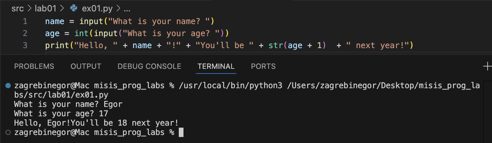


# Задание №2

```python
a = float(input('a:').replace(',', '.'))
b = float(input('b:').replace(',', '.'))
print(f"sum: {a + b}\navg: {(a + b) / 2}")
```
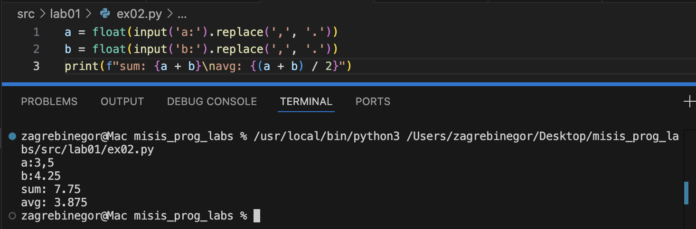


# Задание №3

```python
price = float(input('Цена: '))
disc = float(input('Скидка: '))
vat = float(input('Налог: '))
base = price * (1 - disc/100)
vat_amount = base * (vat/100)
total = base + vat_amount
print(f'База после скидки: {base:.2f}')
print(f'НДС:               {vat_amount:.2f}')
print(f'Итого к оплате:    {total:.2f}')
```
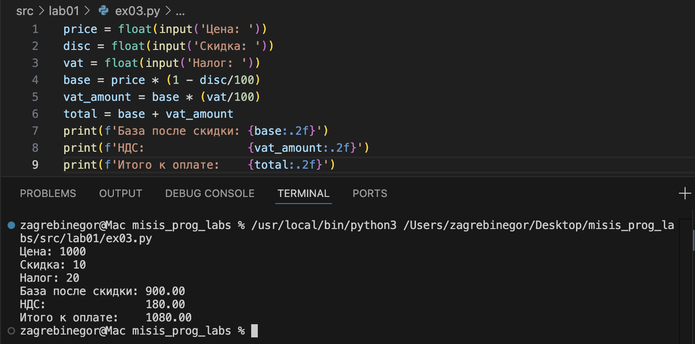


# Задание №4

```python
m = int(input("Минуты: "))
print(f"{m // 60:02d}:{m % 60:02d}")
```
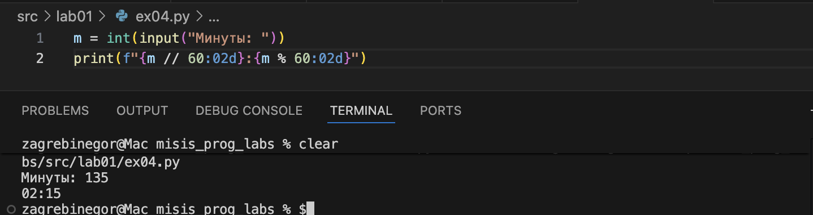


# Задание №5

```python
name = input('ФИО: ')
print(f'Инициалы: {''.join([i[0].upper() for i in name.split()])}.')
print(f'Длина (символов): {len(''.join(name.split())) + 2}')
```
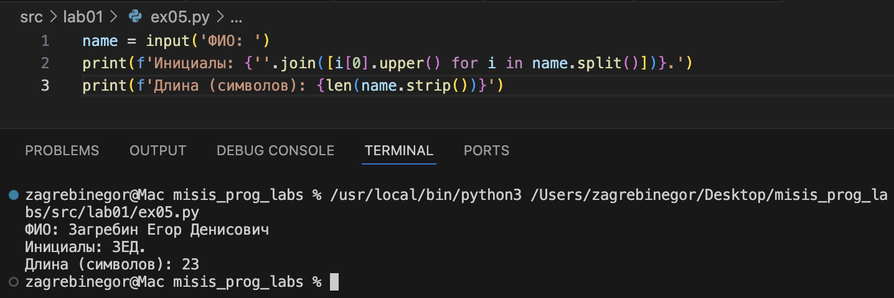


# ЛАБОРАТОРНАЯ РАБОТА №2


# Задание 1 -> arrays

# 1 min_max

```python
def min_max(nums: list[float | int]) -> tuple[float | int, float | int]:
    if len(nums) == 0:
        return ValueError
    mn = 9e6 
    mx = -9e6 
    for i in range(len(nums)):
        if nums[i] < mn:
            mn = nums[i]
        if nums[i] > mx:
            mx = nums[i]
    return tuple([mn, mx])
print(min_max())
```
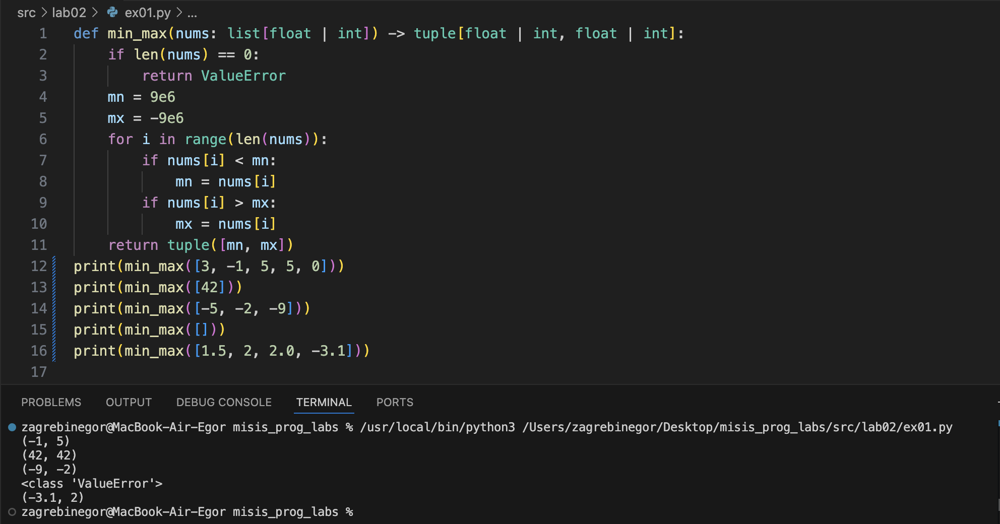

# 2 unique_sorted

```python
def unique_sorted(nums1: list[float | int]) -> list[float | int]:
    unique_nums = set(nums1)
    return sorted(unique_nums)
print(unique_sorted())
```
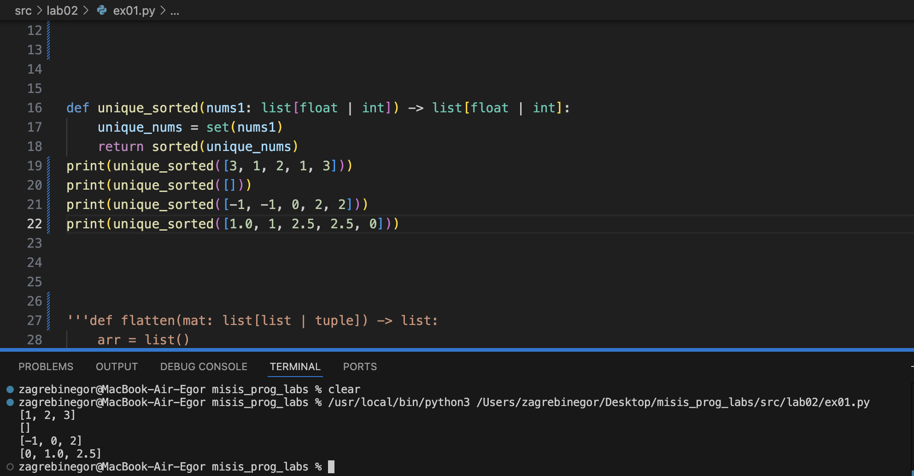

# 3 flatten

```python
def flatten(mat: list[list | tuple]) -> list:
    arr = list()
    for a in mat:
        if not(isinstance(a, list) or isinstance(a, tuple)):
            return TypeError
        for el in a:
            arr.append(el)
    return arr 
print(flatten())
```
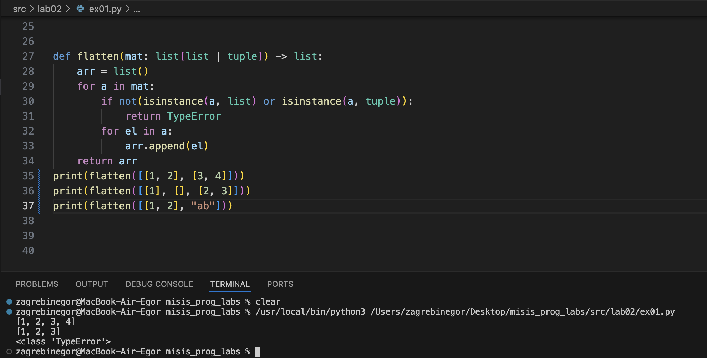


# Задание 2 -> matrix

# Вспомогательная функция 
## С ее помощью проверяю длину строк матрицы. Если длина строк разная, значит матрица - рваная, возвращаю ValueError.

```python
def dliny(mat):
    if any(len(mat[0]) != len(mat[s]) for s in range(len(mat))):
        return False
    return True
```

# 1 transpose

```python
def transpose(mat: list[list[float | int]]) -> list[list]:
    if len(mat) == 0:
        return []
    if dliny(mat) == False:
        return ValueError
    newmat = [[0 for stro in range(len(mat))] for stol in range(len(mat[0]))]
    for strok in range(len(mat)):
        for stolb in range(len(mat[strok])):
            newmat[stolb][strok] = mat[strok][stolb]
    return newmat

print(transpose())
```
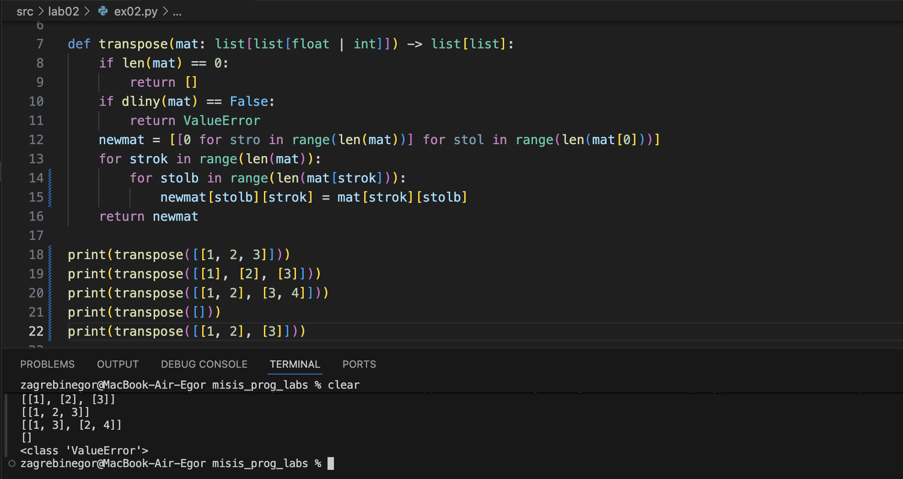

# 2 row_sums

```python
def row_sums(mat: list[list[float | int]]) -> list[float]:
    if len(mat) == 0:
        return []
    if dliny(mat) == False:
        return ValueError
    sums = []
    for i in mat:
        sums.append(sum(i))
    return sums

print(row_sums())
```
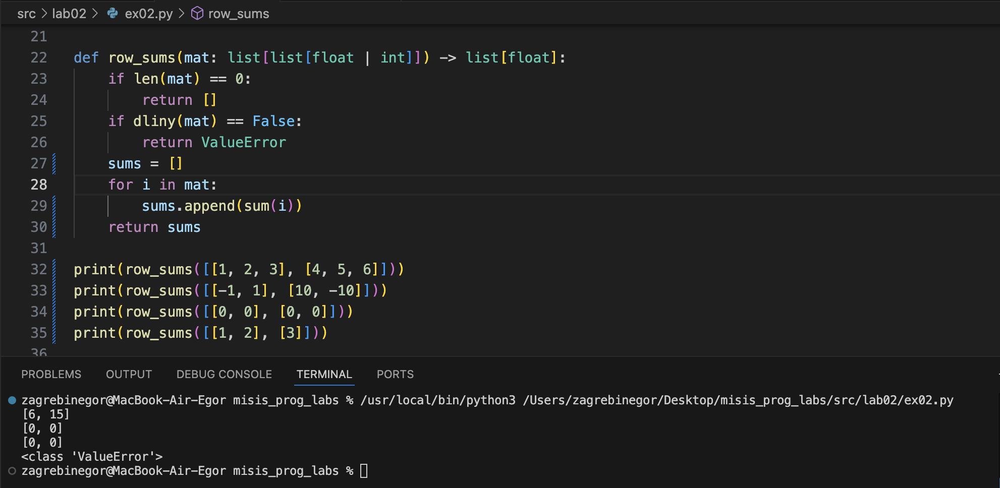

# 3 col_sums

```python
def col_sums(mat: list[list[float | int]]) -> list[float]:
    if dliny(mat) == False:
        return ValueError
    return row_sums(transpose(mat))

print(col_sums())
```
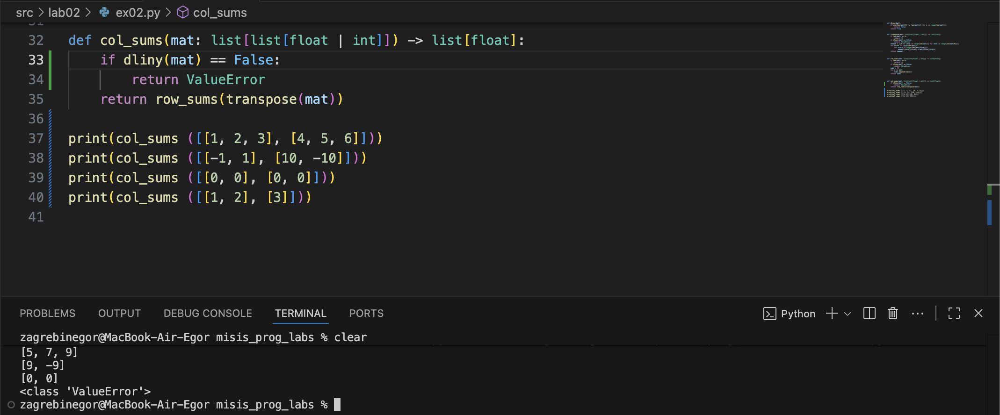


# Задание 3 -> tuples

```python
def format_record(rec: tuple[str, str, float]) -> str:
    
    name_processing = rec[0].strip().split()
    final_name = ''
    if len(name_processing) == 1:
        final_name = f"{name_processing[0][0].upper()}{name_processing[0][1:]}"
    elif len(name_processing) == 2:
        final_name = f"{name_processing[0][0].upper()}{name_processing[0][1:]} {name_processing[1][0:1].upper()}."
    elif len(name_processing) == 3:
        final_name = f"{name_processing[0][0].upper()}{name_processing[0][1:]} {name_processing[1][0:1].upper()}. {name_processing[2][0:1].upper()}."
    else:
        return ValueError
    
    group = ''
    group_processing = rec[1].strip()
    if group_processing == '':
        return ValueError
    else:
        group = group_processing

    gpa = float(rec[2])
    if not(isinstance(gpa, float)):
        return TypeError
    
    return f"{final_name}, гр. {group}, GPA: {gpa:.2f}"   

print(format_record(()))
```
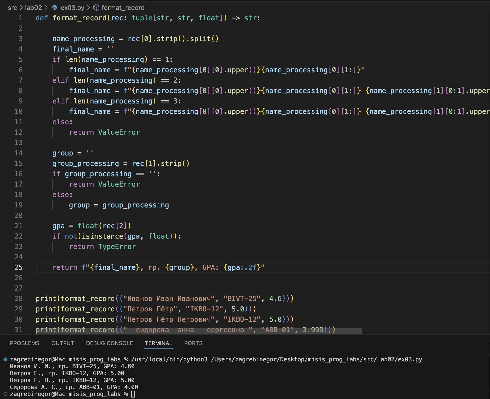


# ЛАБОРАТОРНАЯ РАБОТА №3


## Задание A -> `src/lib/text.py`
## Реализую функции в модуле `src/lib/text.py`. 
## Далее вывожу результат в `src/lab03/A.py`. 

### normalize

```python
def normalize(text: str, *, casefold: bool = True, yo2e: bool = True) -> str:
    if not(isinstance(text, str)):
        return TypeError
    if casefold:
        text = text.casefold()
    if yo2e:
        text = text.replace('Ё', "Е").replace('ё', 'е')
    text = text.replace('\t', ' ').replace('\r', ' ').replace('\n', ' ')
    text = ' '.join(text.split())
    return text.strip()
```

### tokenize

```python
def tokenize(text: str) -> list[str]:
    if not(isinstance(text, str)):
        return TypeError
    pattern = r"\w+(?:-\w+)*"
    string = text
    tokens = finditer(pattern, string)
    return [i.group() for i in tokens]
```

### count_freq

```python
def count_freq(tokens: list[str]) -> dict[str, int]:
    if not(isinstance(tokens, list)):
        return TypeError
    freq = {}
    for i in tokens:
        if i in freq:
            freq[i] += 1
        else:
            freq[i] = 1
    return freq
```

### top_n

```python
def top_n(freq: dict[str, int], n: int = 5) -> list[tuple[str, int]]:
    return sorted(freq.items(), key=lambda x: (-x[1], x[0]))[:n]
```

### Вывод результата в `src/lab03/A.py`.
### Запуск из терминала `python3 -m src.lab03.A`. 

```python
from src.lib.text import normalize, tokenize, top_n, count_freq


print(normalize("ПрИвЕт\nМИр\t"))
print(normalize("ёжик, Ёлка", yo2e=True))
print(normalize("Hello\r\nWorld"))
print(normalize("  двойные   пробелы  "))


print(tokenize("привет мир"))
print(tokenize("hello,world!!!"))
print(tokenize("по-настоящему круто"))
print(tokenize("2025 год"))
print(tokenize("emoji 😀 не слово"))


print(top_n(count_freq(["a", "b", "a", "c", "b", "a"]), n=2))
print(top_n(count_freq(["bb", "aa", "bb", "aa", "cc"]), n=2))
```

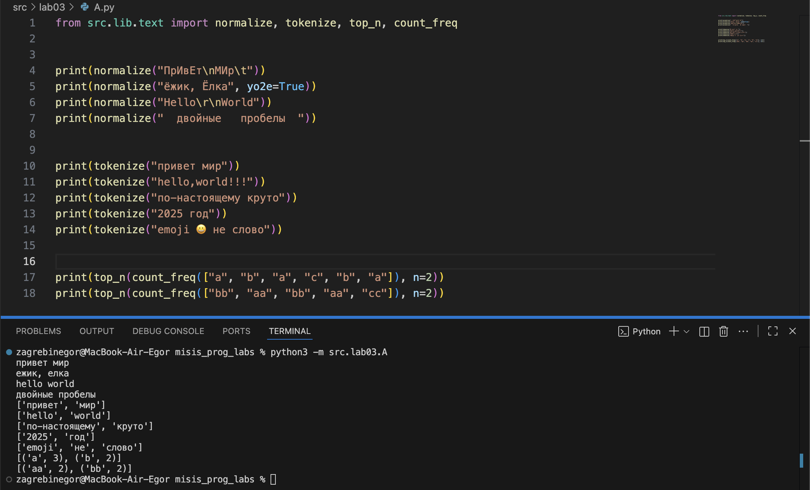

## Задание B -> `src/lab03/B_text_stats`

### Читаем текст из stdin `src/lab03/input.txt`, вызваем функции из `src/lib/text.py`, выводим статистику. 
### Запуск из терминала: `python3 -m src.lab03.B_text_stats < src/lab03/input.txt`. 

```python
import sys
from src.lib.text import count_freq, top_n, normalize, tokenize

text = sys.stdin.read()

tokens = tokenize(text=normalize(text=text))
top = top_n(count_freq(tokens))

print(f"Всего слов: {len(tokens)}")
print(f"Уникальных слов: {len(set(tokens))}")
print("Топ-5:")
for w, c in top:
    print(f"{w}:{c}")
```

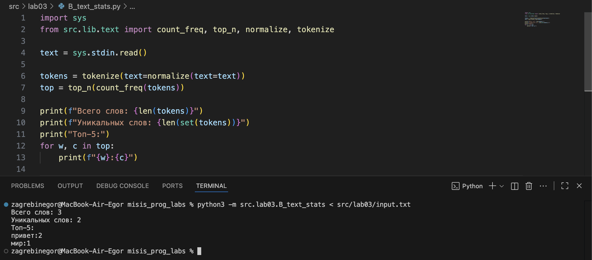


# ЛАБОРАТОРНАЯ РАБОТА №4

## Задание А -> `src/lab04/io_txt_csv.py`

## Реализую функции: 
### 1. `read_text(path: str | Path, encoding: str = "utf-8") -> str`  
        - Открыть файл на чтение в указанной кодировке и вернуть содержимое **как одну строку**;  
        - Обрабатывать ошибки: если файл не найден — поднимать `FileNotFoundError` (пусть падает), если кодировка не подходит — поднимать `UnicodeDecodeError` (пусть падает);  
        - НО: в докстринге опишите, как пользователь может выбрать другую кодировку (пример: `encoding="cp1251"`).
2. `write_csv(rows: list[tuple | list], path: str | Path, header: tuple[str, ...] | None = None) -> None`  
        - Создать/перезаписать CSV с разделителем `,`;  
        - Если передан `header`, записать его первой строкой;  
        - Проверить, что каждая строка в `rows` имеет одинаковую длину (иначе `ValueError`).

```python
import csv
from pathlib import Path
from typing import Iterable, Sequence


def read_text(path: str | Path, encoding: str = "utf-8") -> str:
    p = Path(path)
    return p.read_text(encoding=encoding)

def write_csv(rows: Iterable[Sequence], path: str | Path,
              header: tuple[str, ...] | None = None) -> None:
    p = Path(path)
    rows = list(rows)
    if rows:
        cols = len(rows[0])
        for r in rows:
            if len(r) != cols:
                raise ValueError("Разная длина строк")
    with p.open("w", newline="", encoding="utf-8") as f:
        w = csv.writer(f)
        if header is not None:
            w.writerow(header)
        for r in rows:
            w.writerow(r)
```

## Задание В -> `src/lab04/text_report.py`
### Запуск из терминала `python3 -m src.lab04.text_report`.

1) Читает **один** входной файл `data/input.txt`.  
2) Нормализует текст (`lib/text.py`), токенизирует и считает частоты слов.  
3) Сохраняет `data/report.csv` c колонками: **`word,count`**, отсортированными: count ↓, слово ↑ (при равенстве).  
4) В консоль печатает краткое резюме:  
   - `Всего слов: <N>`  
   - `Уникальных слов: <K>`  
   - `Топ-5:` (список из `top_n` из ЛР3)

```python
from src.lab04.io_txt_csv import read_text, write_csv
from src.lib.text import count_freq, top_n, normalize, tokenize
from pathlib import Path

def text_progress(text):
    tokens = tokenize(normalize(text))
    freq = count_freq(tokens)
    return tokens, freq

in_path = Path("src/data/lab04/input.txt")
out_path = Path("src/data/lab04/report.csv")

text = read_text(in_path)
tokens, freq = text_progress(text)
write_csv(top_n(freq, len(freq)), out_path, header=("word", "count"))

print("Всего слов:", len(tokens))
print("Уникальных слов:", len(freq))
print("Топ-5:")
for word, count in top_n(freq, 5):
    print(f"{word}: {count}")
```

## Выполнение:

### Вход -> `data/lab04/input.txt`:
Привет, мир!!! Привет!

### Вывод в терминале:
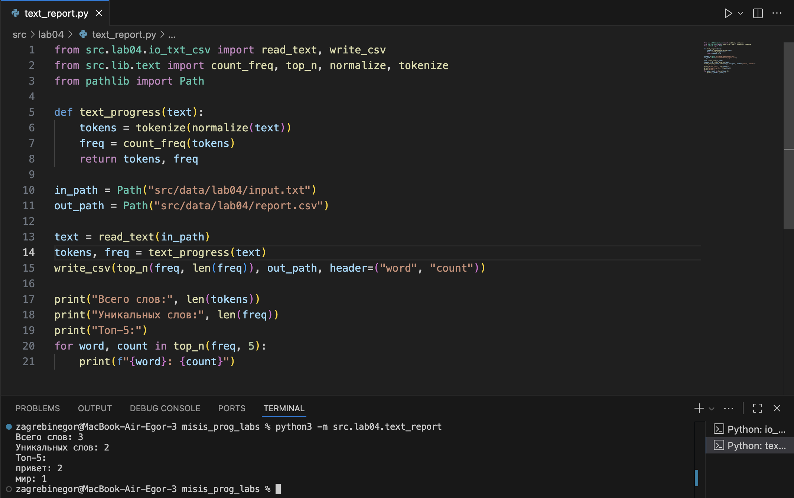

### Отчет CSV -> `data/lab04/report.csv`:
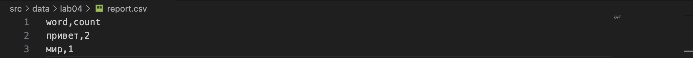


