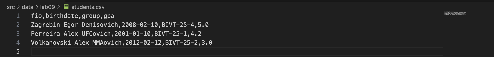
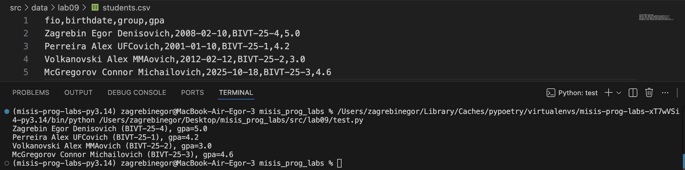
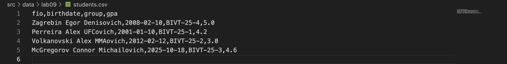
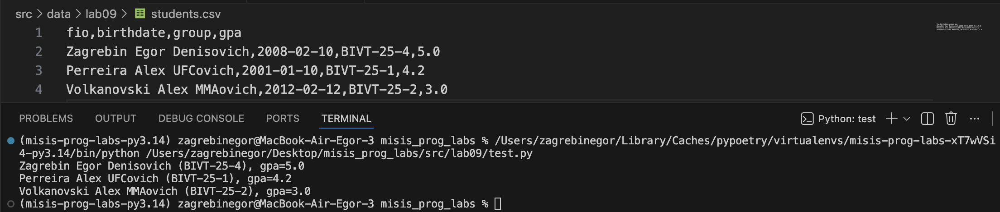
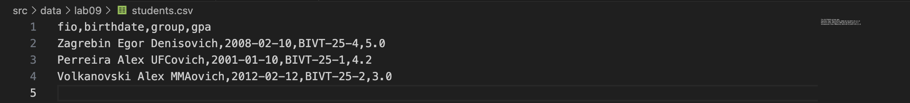
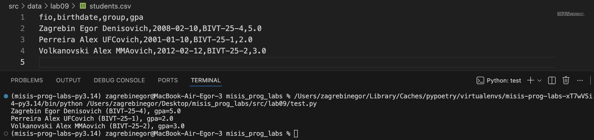

# ЛАБОРАТОРНАЯ РАБОТА №9

## Задание А -> `src/lab09/group.py`

**Требования**:

Класс **`Group`**, реализующий CRUD-операции над студентами:

- инициализацию с путём к CSV-файлу (`__init__`)
- чтение всех записей из CSV
- методы:
  - `add(student: Student)` — добавление студента
  - `list() -> list[Student]` — получить всех студентов
  - `find(substr: str)` — поиск по подстроке в ФИО
  - `remove(fio: str)` — удаление по ФИО
  - `update(fio: str, **fields)` — обновление полей существующей записи

#### Выполнение:

```python
import csv
from pathlib import Path
from src.lab08.models import Student

class Group:
    def __init__(self, storage_path: str):
        self.path = Path(storage_path)
        self.fieldnames = ["fio", "birthdate", "group", "gpa"]
        if not self.path.exists():
            with open(self.path, "w", encoding="utf-8", newline="") as f:
                writer = csv.DictWriter(f, fieldnames=self.fieldnames)
                writer.writeheader()

    def _read_all(self):
        with open(self.path, "r", encoding="utf-8") as f:
            reader = csv.DictReader(f)
            return list(reader)

    def list(self):
        rows = self._read_all()
        return [
            Student(
                fio=row["fio"],
                birthdate=row["birthdate"],
                group=row["group"],
                gpa=float(row["gpa"]),
            )
            for row in rows
        ]

    def add(self, student: Student):
        with open(self.path, "a", encoding="utf-8", newline="") as f:
            writer = csv.DictWriter(f, fieldnames=self.fieldnames)
            writer.writerow(student.to_dict())

    def find(self, substr: str):
        students = self.list()
        result = []
        substr_lower = substr.lower()
        for s in students:
            if substr_lower in s.fio.lower():
                result.append(s)
        return result

    def remove(self, fio: str):
        rows = self._read_all()
        rows = [r for r in rows if r["fio"] != fio]
        with open(self.path, "w", encoding="utf-8", newline="") as f:
            writer = csv.DictWriter(f, fieldnames=self.fieldnames)
            writer.writeheader()
            writer.writerows(rows)

    def update(self, fio: str, **fields):
        rows = self._read_all()
        for r in rows:
            if r["fio"] == fio:
                for key, value in fields.items():
                    r[key] = value
        with open(self.path, "w", encoding="utf-8", newline="") as f:
            writer = csv.DictWriter(f, fieldnames=self.fieldnames)
            writer.writeheader()
            writer.writerows(rows)
```

#### Результат:

Данные хранятся в `src/data/lab09/students.csv`, работать будем с ними. 

Для удобства проверки CRUD-операций, реализуемых в ЛР9, я буду использовать модуль `src/lab09/test.py`.

```python
from src.lab09.group import Group
from src.lab08.models import Student

group = Group("src/data/lab09/students.csv")
group.update("Perreira Alex UFCovich", gpa=2.0)
for s in group.list():
    print(s)
```

**Проверка выполнения**:

- **add**

Изначально `students.csv` имел вид:



В **`src/lab09/test.py`** прописываю:
 `group.add(Student("McGregorov Connor Michailovich", "2025-10-18", "BIVT-25-3", 4.6))`

Конечный результат, полученный после добавления студеннта:



- **remove**

Теперь `students.csv` выглядит так:



В **`src/lab09/test.py`** указываю:
 `group.remove("McGregorov Connor Michailovich")`

Результат выполнения:



- **update**

Начальный вид `students.csv`:



Изменяю **`src/lab09/test.py`**:
 `group.update("Perreira Alex UFCovich", gpa=2.0)`

Финальный результат:

