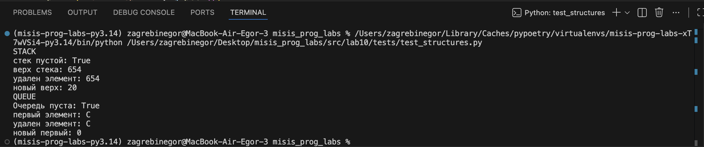
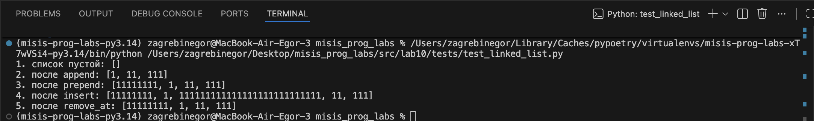

# ЛАБОРАТОРНАЯ РАБОТА №10

## Задание А -> `src/lab10/structures.py`. 

### Реализовать **`Stack`** и **`Queue`**: 

**Требования**:

**`Stack`**

**Методы (минимум):**

- `push(item) -> None`  
  Добавить элемент на вершину стека.

- `pop() -> Any`  
  Снять верхний элемент стека и вернуть его.  
  Если стек пуст — выбросить понятное исключение (например, `IndexError` с вменяемым сообщением).

- `peek() -> Any | None`  
  Вернуть верхний элемент **без удаления**.  
  Если стек пуст — вернуть `None` (или тоже бросать исключение, но тогда это нужно описать в README).

- `is_empty() -> bool`  
  Вернуть `True`, если стек пуст, иначе `False`.

- `is_empty() -> bool`  
  Вернуть `True`, если очередь пуста.

**`Queue`**

**Методы (минимум):**

- `enqueue(item) -> None`  
  Добавить элемент в конец очереди.

- `dequeue() -> Any`  
  Взять элемент из начала очереди и вернуть его.  
  Если очередь пустая — выбросить понятное исключение (например, `IndexError`).

- `peek() -> Any | None`  
  Вернуть первый элемент **без удаления**.  
  Если очередь пустая — вернуть `None` (или бросить исключение, но это нужно явно описать).

- `is_empty() -> bool`  
  Вернуть `True`, если очередь пуста.

#### Выполнение:

```python
from collections import deque


class Stack:
    def __init__(self):
        self._data = []

    def push(self, item):
        self._data.append(item)  # добавить на вершину

    def pop(self):
        if self.is_empty():
            raise IndexError("стек пустой")
        return self._data.pop()  # снять верхний

    def peek(self):
        if self.is_empty():
            return None
        return self._data[-1]  # вернуть верхний без удаления

    def is_empty(self):
        return len(self._data) == 0  # вернуть True, если стек пуст


class Queue:
    def __init__(self):
        self._data = deque()

    def enqueue(self, item):
        self._data.append(item)  # добавить в конец очереди

    def dequeue(self):
        if self.is_empty():
            raise IndexError("очередь пустая")
        return self._data.popleft()  # взять из начала очереди

    def peek(self):
        if not self._data:
            return None
        return self._data[0]  # вернуть первый элемент без удаления

    def is_empty(self):
        return len(self._data) == 0  # вернуть True, если очередь пуста
```
#### Результат тестирования:

Для удобства тестирования, использую отдельный модуль `src/lab10/tests/test_structures.py`. 



## Задание В -> `src/lab10/linked_list.py`

### Реализовать **`SinglyLinkedList`**:

**Требования**:

**Методы (минимум):**

- `append(value) -> None`  
  Добавить элемент в конец списка.  
  При наличии `tail` — за `O(1)`, без него — допустимо `O(n)` проходом от `head`.

- `prepend(value) -> None`  
  Добавить элемент в начало списка за `O(1)`.

- `insert(idx: int, value) -> None`  
  Вставить элемент по индексу `idx`.  
  Требования:
  - допускается вставка в начало (`idx == 0`) и в конец (`idx == len(list)`);
  - при индексе вне диапазона `[0, len(list)]` — выбросить `IndexError`.

- `remove(value) -> None` **или** `remove_at(idx: int) -> None`  
  На выбор:
  - либо удалить **первое вхождение** значения `value` (если нет — можно ничего не делать или бросать исключение, задокументировав поведение);
  - либо удалить элемент по индексу `idx` (при некорректном индексе — `IndexError`).

- `__iter__(self)`  
  Возвращает итератор по значениям в списке (в порядке от головы к хвосту).

- `__len__(self) -> int`  
  Возвращает количество элементов (`self._size`).

- `__repr__(self) -> str`  
  Возвращает строковое представление, например:  
  `SinglyLinkedList([1, 2, 3])`.

#### Выполнение: 

```python
class Node:
    def __init__(
        self, value, next=None
    ):  # значение элемента и ссылка на следующий узел
        self.value = value
        self.next = next


class SinglyLinkedList:
    def __init__(self):  # голова списка и размер
        self.head = None
        self._size = 0

    def append(self, value):  # добавить в конец
        new_node = Node(value)
        if self.head is None:
            self.head = new_node
            self._size = 1
            return

        current = self.head
        while current.next is not None:
            current = current.next

        current.next = new_node
        self._size += 1

    def prepend(self, value):  # добавить в начало
        new_node = Node(value, next=self.head)
        self.head = new_node
        self._size += 1

    def insert(self, idx, value):  # вставка по индексу
        if idx < 0 or idx > self._size:
            raise IndexError("index out of range")

        if idx == 0:
            self.prepend(value)
            return

        if idx == self._size:
            self.append(value)
            return

        current = self.head
        for _ in range(idx - 1):
            current = current.next

        new_node = Node(value, next=current.next)
        current.next = new_node
        self._size += 1

    def remove_at(self, idx):  # удалить по индексу
        if idx < 0 or idx >= self._size:
            raise IndexError("index out of range")

        if idx == 0:
            self.head = self.head.next
            self._size -= 1
            return

        current = self.head
        for _ in range(idx - 1):
            current = current.next

        current.next = current.next.next
        self._size -= 1

    def __iter__(self):  # пройти по списку
        current = self.head
        while current is not None:
            yield current.value
            current = current.next

    def __len__(self):  # размер списка
        return self._size

    def __repr__(self):  # вывод списка
        values = list(self)
        return f"SinglyLinkedList({values})"
```

#### Результат:

Для удобства тестирования, использую отдельный модуль `src/lab10/tests/test_linked_list.py`. 


